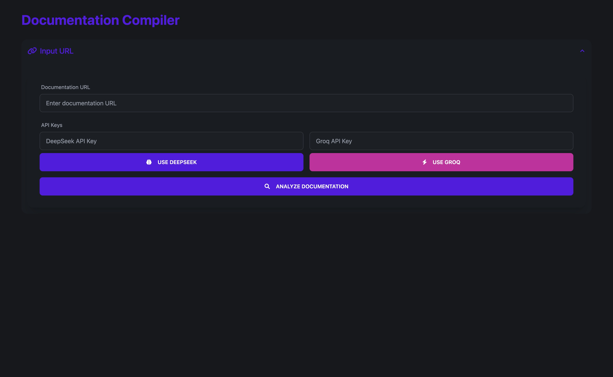

# Documentation Crawler

A powerful tool that crawls documentation websites and generates a clean, well-formatted markdown document. Built with FastAPI and support for multiple LLM providers (DeepSeek and Groq).



## Features

- 🌐 **Web Crawling**: Automatically crawls documentation websites and extracts content
- 🌳 **Tree Structure**: Maintains the original documentation hierarchy
- ✨ **Clean Output**: Generates well-formatted markdown documents
- 🎯 **Selective Processing**: Choose which pages to include in the final document
- 🔄 **Multiple LLM Support**: 
  - DeepSeek API integration
  - Groq API integration
- 🎨 **Modern UI**:
  - Dark mode by default
  - Interactive documentation tree
  - Real-time processing feedback
  - Copy and download options

## Installation

1. Clone the repository:
```bash
git clone https://github.com/kr3t3n/documentation-crawler.git
cd documentation-crawler
```

2. Install dependencies:
```bash
pip install -r requirements.txt
```

3. Run the application:
```bash
python main.py
```

The application will be available at `http://127.0.0.1:8000`

## API Keys

You'll need at least one of these API keys to use the application:

- [DeepSeek API Key](https://platform.deepseek.com/)
- [Groq API Key](https://console.groq.com/)

## Usage

1. Enter the documentation URL you want to process
2. Choose your preferred API (DeepSeek or Groq) and enter the API key
3. Wait for the crawler to analyze the documentation structure
4. Select the pages you want to include in the final document
5. Click "Generate Markdown" to process the selected pages
6. Copy or download the generated markdown

## Project Structure

```
documentation-crawler/
├── main.py              # FastAPI application and endpoints
├── crawler.py           # Documentation crawling logic
├── processor.py         # Content processing and LLM integration
├── requirements.txt     # Project dependencies
├── static/             # Static assets
└── templates/          # HTML templates
    └── index.html      # Main application interface
```

## Contributing

Contributions are welcome! Feel free to:

1. Fork the repository
2. Create a feature branch
3. Submit a pull request

## 👨‍💻 Author

Created by [Georgi](https://x.com/georgipep) from Mangia Studios Limited.

## ❤️ Support

If you find Documentation Crawler useful, consider [buying me a coffee ☕](https://www.buymeacoffee.com/georgipep)

## License

This project is licensed under the MIT License - see the [LICENSE](LICENSE) file for details.

## Acknowledgments

- Built with [FastAPI](https://fastapi.tiangolo.com/)
- UI powered by [DaisyUI](https://daisyui.com/) and [Tailwind CSS](https://tailwindcss.com/)
- Animations by [Anime.js](https://animejs.com/) 